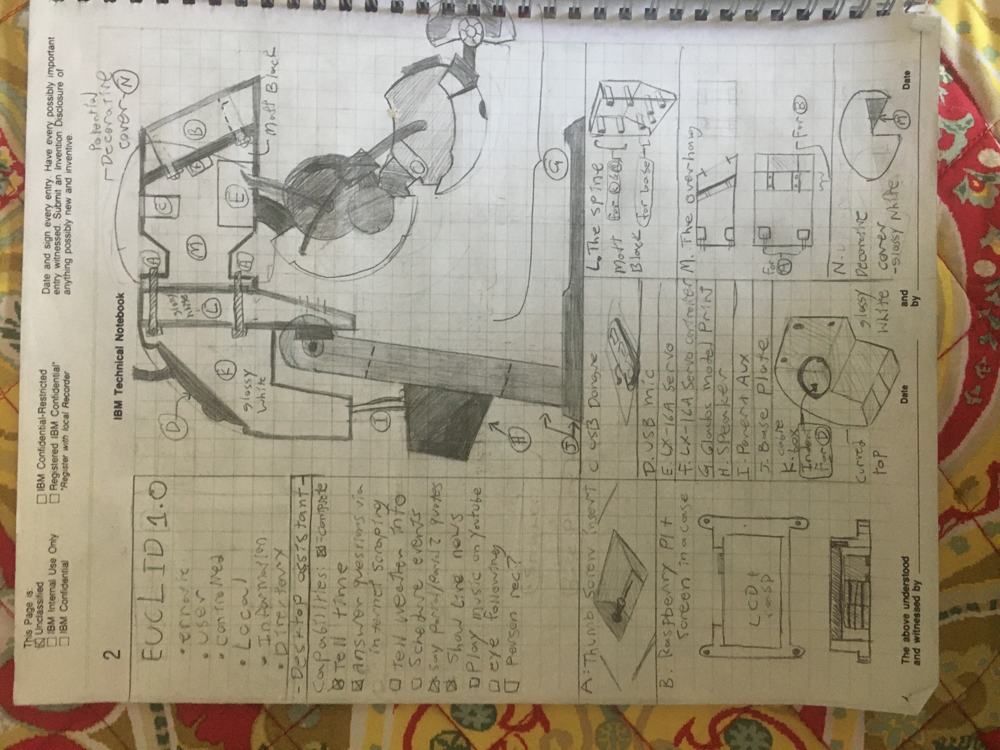
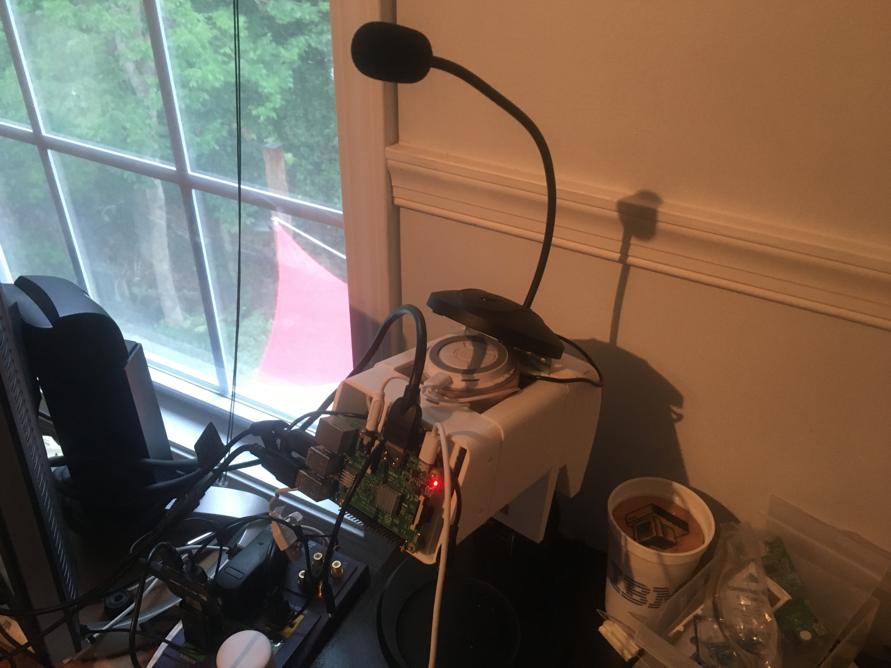
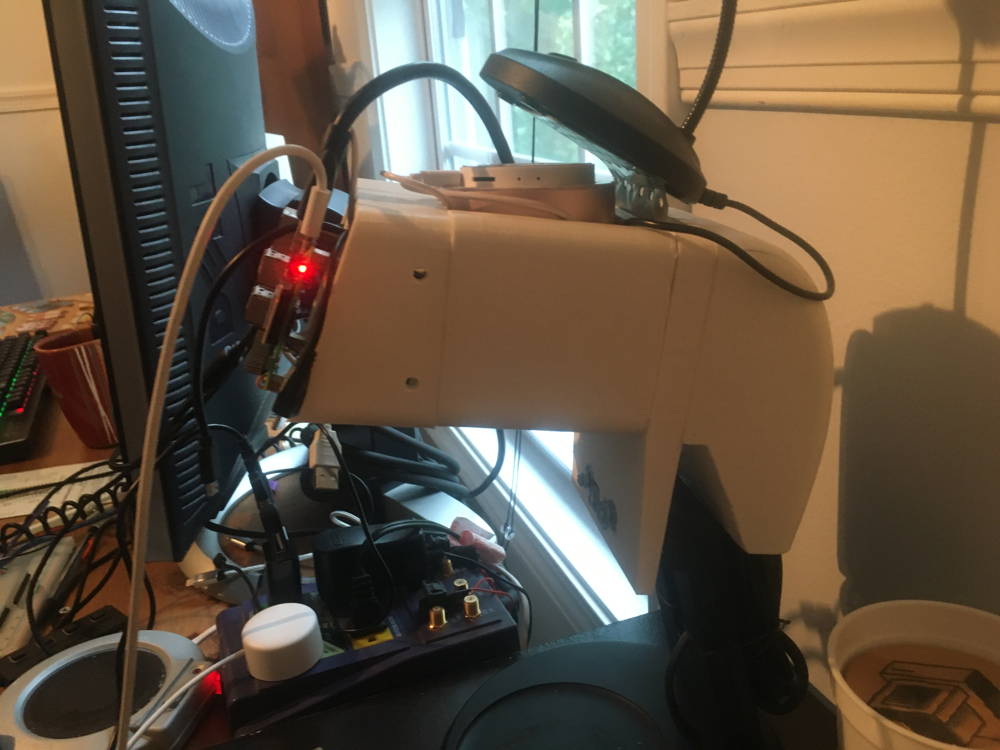

# E.U.C.L.I.D-voice-assistant

This repository contains all the code and voice files for the EUCLID voice assistant project started in summer 2020.

The purpose of this system is to develop an efficent voice assistant capable of understanding multiple commands from a single phrase, without the need of a wake command. 

The biggest issue so far is getting an offline speech recognition system online due to how much out of date documentation there is on raspberry pi speech rec.

The character mount underneath is meant to acomodate a modified version of this 3D printed GLaDOS lamp:
https://www.instructables.com/id/A-fully-3D-printable-GlaDOS-Robotic-ceiling-arm-la/

# Initial Design:

# Current State:

